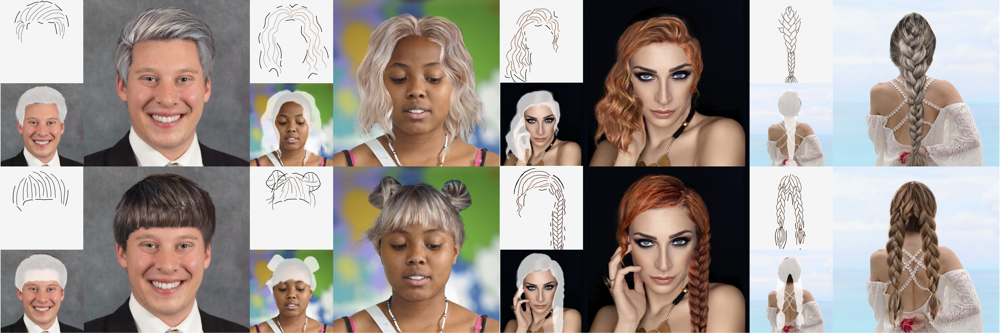

# SketchHairSalon: Deep Sketch-based Hair Image Synthesis



> Chufeng Xiao, Deng Yu, [Xiaoguang Han](https://mypage.cuhk.edu.cn/academics/hanxiaoguang/), [Youyi Zheng](https://www.youyizheng.net/), [Hongbo Fu](https://sweb.cityu.edu.hk/hongbofu/)
>
> [[Paper]](https://arxiv.org/abs/2109.07874) [[Project Page]](https://chufengxiao.github.io/SketchHairSalon/) [[Pretrained Models]](#Pretrained Models)  [[Dataset]](#Dataset) [[Supplemental Material]](https://github.com/chufengxiao/SketchHairSalon/blob/project-page/supp.pdf) [[Video]](https://www.youtube.com/watch?v=riJlGrRfA4Y)
>
> Accepted by SIGGRAPH Asia 2021

## Prerequisites

Clone this repository and install the dependent libraries (Anaconda recommended):

```bash
git clone https://github.com/chufengxiao/SketchHairSalon.git
cd SketchHairSalon
pip install -r requirements.txt
```

The main dependencies are

* python == 3.6.12
* torch == 1.0.0
* numpy == 1.19.1
* scipy == 1.5.3
* mayavi == 4.7.2

## Getting Started

### Pretrained Models

Please download our [pretrained models](https://drive.google.com/file/d/1XiJbvWxzDCZaA-p1s6BWKasIMVlHcOrx/view?usp=sharing) and put the `S2M`, `S2I_unbraid`, `S2I_braid` folders into the `checkpoints` folder.

### Fast Testing

If you only want to fast test some results using the pretrained models, you can directly run the below command to test the samples in the `test_img` folder. The testing consists of two stages and produce the final results in the `results` folder.

```bash
# python full_test.py [hair_type: unbrfaid or braid]
python full_test.py unbraid
```

### Dataset

You can download our created [dataset](https://drive.google.com/file/d/1hbQhEBmyDLtXnDMJabKTBRjgHMycG2YO/view?usp=sharing) and put them into the `dataset` folder for further training and testing. If you download and use the dataset, you agree to the below items:

* The dataset is available for non-commercial research purposes only.
* All images of the dataset are obtained from the Internet which are not property of us. We are not responsible for the content nor the meaning of these images.
* All mattes of the dataset are auto-generated from the images by [CGA-matting](https://github.com/Yaoyi-Li/GCA-Matting).
* All sketches of the dataset are traced by users we hired.
* You agree not to reproduce, duplicate, copy, sell, trade, resell or exploit for any commercial purposes, any portion of the images and any portion of derived data.
* We reserves the right to terminate your access to *SketchHairSalon* dataset at any time.

### Network Training and Testing

You can fine-tune and test each stage of our networks (Sketch2Matte and Sketch2Image) using the scripts:

```bash
# You can run one line of the below commands for certain purpose

## For fine-tuning (The checkpoint and resulting files will be saved in the 'checkpoints' folder):
sh scripts/train_S2M.sh # Sketch2Matte
sh scripts/train_S2I_unbraid.sh # Sketch2Image (unbraid)
sh scripts/train_S2I_braid.sh # Sketch2Image (braid)

## For tessting (The results will be saved in the 'results' floder):
sh scripts/test_S2M.sh # Sketch2Matte
sh scripts/test_S2I_unbraid.sh # Sketch2Image (unbraid)
sh scripts/test_S2I_braid.sh # Sketch2Image (braid)
```

If you want to train the models from scratch, then remove `--continue_train` and `--epoch` command in the training scripts, for example:

```bash
python train.py --dataroot ./dataset/ --name S2M --model pix2pix --netG unet_at --dataset_mode matte --use_aug --batch_size 10 --save_epoch_freq 50 --epoch_count 1 --n_epochs 200 --n_epochs_decay 0 --display_freq 10 --save_latest_freq 40000  --print_freq 100 --no_flip --gpu_ids 0
```

### Auto-completion Modules

You can test the two auto-completion modules by running the below commands for unbraided and braided hairstyles respectively:

```bash
cd autocompletion
python unbraid_completion.py
python braid_completion.py
```

## Acknowledgments

This code is developed based on [pix2pix](https://github.com/phillipi/pix2pix) and [DANet](https://github.com/junfu1115/DANet).

## BibTeX

```tex
@article{xiao2021sketchhairsalon,
  title={SketchHairSalon: deep sketch-based hair image synthesis},
  author={Xiao, Chufeng and Yu, Deng and Han, Xiaoguang and Zheng, Youyi and Fu, Hongbo},
  journal={ACM Transactions on Graphics (TOG)},
  volume={40},
  number={6},
  pages={1--16},
  year={2021},
  publisher={ACM New York, NY, USA}
}
```

